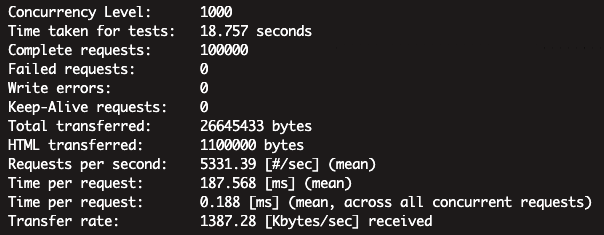
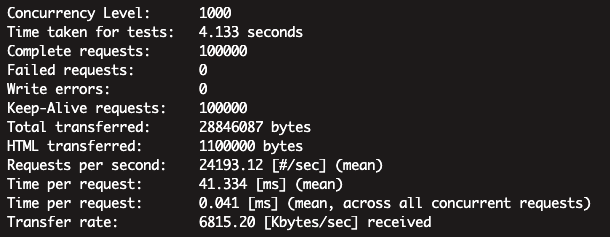

## Fend

Fend框架是一款很有历史的框架、初代发布后一直在好未来坊间传播使用、衍生出大量分支版本 

2019年7月 我们对Fend进行整理、封装、推广、目前在好未来内部有大量的用户在使用、维护 

2020年7月 开源、以此共建交流 

我们崇尚 `脚踏实地、仰望星空` 精神 欢迎小伙伴一起参与开源共建

## 设计方向

Fend 框架是一款以企业快速实现业务为主要目标的框架，但与复杂的行业流行框架追求不同： 
 * `简单实用`：追求快速上手，扩展功能一步到位、大量降低功能的复杂度、框架更注重简单实用实现
 * `单层内核`：追求一个函数能实现的功能绝不继承封装，不追求框架自身功能的继承可复用 
 * `内聚归类`：高度集中归类功能，降低底层复杂度，减少底层组件关注度、让过程更多时间在业务
 * `持续积累`：持续积累大型互联网线上运营经验，持续探索企业实用技巧，深度来自于积累而非AOP带来的灵活性
 * `内核设计`：高内聚简单内核，放开业务自封装空间，留下更多空间给业务
 * `开源心态`：开放公开，接受任何符合价值观源码奉献、但有严格代码审核

## 功能简介
 * Swoole/FPM 双引擎平滑切换(协程版本还在整理稍晚放出)
 * 统一使用 Composer Autoload PSR4
 * 请求Debug 模式，请求网址wxdebug=1可查看debug模式查看异常分析性能
 * 协程模式下对变量域做了更好的封装，降低协程使用难度
 * 支持压测使用灰度影子库
 * 高速map映射路由 + FastRouter正则路由
 * 符合大数据挖掘设计的Trace日志，方便ELK分析、ClickHouse、HBase、实时预警
 * throw new Exception方式处理业务异常、能够快速发现异常

## 性能压测
目前是在KVM虚拟机上压测、后续会找一台阿里云进行压测 

### FPM性能
 服务器配置
 * CPU 4 核 Xeon 2.2
 * 内存 12G
 * KVM + CentOS 7.6
 * FPM 开启进程数 500
 
  
 
QPS 5331 (分析：fpm空跑hello 1w、引入composer autoload 后 7000、开启日志trace 6000、框架内echo 5000)
 
### Swoole 1.10.x 性能
 服务器配置
 * CPU 4 核 Xeon 2.2
 * 内存 12G
 * KVM + CentOS 7.6
 * FPM 开启进程数 500
 
  
  
QPS 24000、协程版本稍晚放出

### Release Note
 * Tag 1.2.x FPM/Swoole 1.10.x support FPM \<-\> Swoole 1.10.x
 * Tag 1.3.x FPM/Swoole 4.5.x support FPM \<-\> Swoole Coroutine 4.5.x

## Install for 1.2.x branch

#### FPM Engine Start
master is 1.2.x version 

```bash
composer create-project fend/fend-skeleton project_name
```

Ref [nginx.conf](https://github.com/tal-tech/fend/blob/master/nginx.conf) to configure Nginx and http://127.0.0.1/ on browser 

#### Swoole Engine Start

```bash
composer create-project fend/fend-skeleton project_name

# swoole start ( /bin/fend depend on composer require symfony/console )
php /bin/fend Swoole -c app/Config/Swoole.php start
php /bin/start.php -c app/Config/Swoole.php start
```

browser http://127.0.0.1:9572/ 

## 合作伙伴
好未来教育集团90%在线业务在使用本框架

<ul style="line-height: 80px;list-style: none">
    <li><a href="https://www.xueersi.com">  </a></li>
    <li><a href="https://fudao.xes1v1.com/">  </a></li>
    <li><a href="http://www.jzb.com/">  </a></li>
    <li><a href="https://xiaohou.xueersi.com/">  </a></li>
</ul>

## 共建规则
欢迎挑战组件功能、允许同类功能同时发布竞争、以 性能好 + 实用及实现简单 + 功能实用 评判

## 联系我们
issue: [https://github.com/tal-tech/fend/issues](https://github.com/tal-tech/fend/issues) 

加群请加微信： 

 